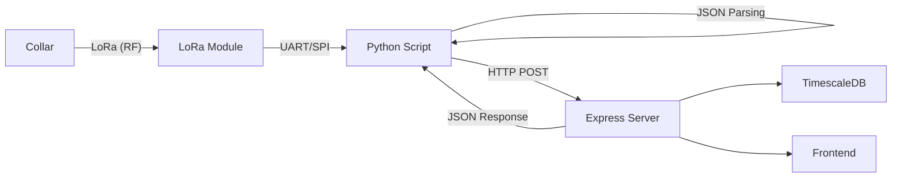

# System Patterns

## Architecture


## Data Ingestion Flow (Hardware & Software)
### 1. Collar → BeagleBone (The "Edge")
- **Technology**: LoRa (Long Range) RF via UART/SPI interface.
- **Hardware**: BeagleBone Black with SX1276/RFM95 LoRa module.
- **Process**:
  1. Collar transmits raw string packet (e.g., `ID=9920;BATT=3.70...;MOV=128`).
  2. LoRa module receives signal and passes bytes to BeagleBone via Serial/UART.
  3. Python/C++ daemon on BeagleBone reads serial port (`/dev/ttyS0`).
  4. Script parses raw string into structured JSON object.

### 2. BeagleBone → Backend (The "Bridge")
- **Technology**: HTTP REST API over Ethernet/WiFi/Cellular.
- **Process**:
  1. BeagleBone constructs JSON payload.
  2. POSTs to `http://<SERVER_IP>:3001/api/collars/data`.
  3. **Bidirectional Sync**: Backend responds with HTTP 201. If a new config exists (e.g., assigned ID), it's included in the response body (`pending_config`).
  4. BeagleBone checks `pending_config` and immediately transmits new settings back to collar via LoRa (RX Window).

## Collar Registration Pattern
1. New collar uses reserved ID (9999)
2. Backend auto-registers on first data POST
3. Farmer assigns via UI → generates unique ID (100+)
4. Next POST response includes `pending_config: { new_id: X }`
5. BeagleBone sends ID to collar during RX window
6. Collar stores in EEPROM, uses for future TX

## IMU & Activity Classification

### What the Collar Sends
The collar sends **MOV (Movement Intensity)**, NOT activity classification:

| Field | Size | Description |
|-------|------|-------------|
| MOV | 1 byte (0-255) | Motion magnitude: `sqrt(ax² + ay² + az²) * scale` |
| Raw IMU (optional) | 12 bytes | 3-axis accel + 3-axis gyro (int16 each) |

**Important**: The collar MCU has limited compute power. It can only calculate a simple motion magnitude, not complex activity patterns.

### Where Classification Happens

| Classification Level | Where | Examples |
|---------------------|-------|----------|
| Basic | BeagleBone | Moving, Resting, Standing, Lying |
| Advanced (ML) | Backend | Rumination, Grazing, Health patterns, Estrus |

### Data Flow for Activity Classification
```
Collar (MCU)           BeagleBone                 Backend
    │                       │                         │
    │  MOV + Raw IMU        │                         │
    ├──────────────────────►│                         │
    │                       │ Buffer samples          │
    │                       │ Compute features        │
    │                       │ Basic classification    │
    │                       │                         │
    │                       │  Aggregated windows     │
    │                       ├────────────────────────►│
    │                       │                         │ ML classification
    │                       │                         │ Health scoring
    │                       │                         │ Alert generation
```

## Health Status Logic
```javascript
// Critical (alert)
body_temp > 40°C OR body_temp < 37°C
battery_voltage < 3.0V
heart_rate > 100 OR heart_rate < 40
spo2 < 90%

// Warning
body_temp 39.5-40°C OR body_temp 37-37.5°C
battery_voltage 3.0-3.3V
heart_rate 84-100 OR heart_rate 40-48
spo2 90-95%
```

## Data Flow Patterns
- **Telemetry**: Collar → BeagleBone → POST /api/collars/data → DB + in-memory Map
- **Movement Intensity (MOV)**: Computed on collar, stored in LocationHistory
- **Activity Classification**: Computed on BeagleBone (basic) or Backend (advanced ML)
- **Config**: Returned in POST response (polling pattern)

## Frontend Patterns
- React Router for navigation
- Polling every 5s for real-time data
- CSS custom properties design system
- Lucide React for icons
- Chart.js for visualizations

## Coding Standards
- Use quoted table names for PostgreSQL ("Collars", "Cattle")
- Environment variables for DB connection
- Reserved collar_id = 9999 for unassigned
- Collar IDs assigned starting from 100