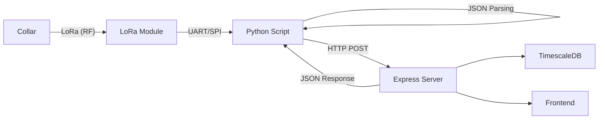
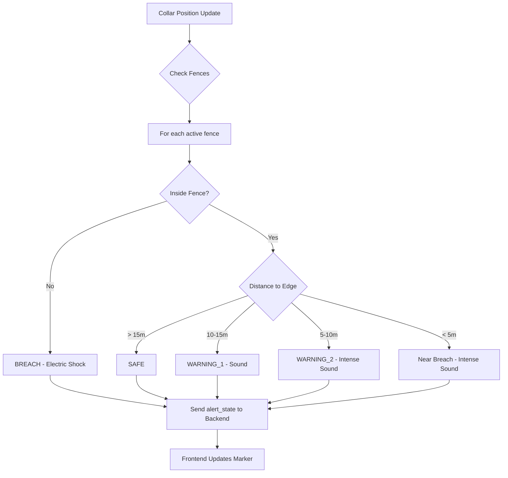
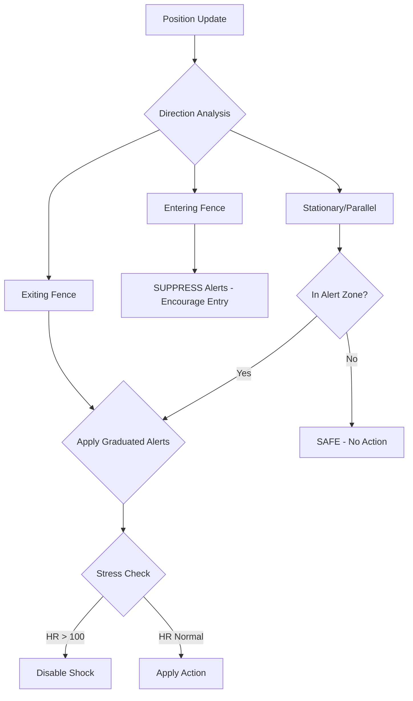
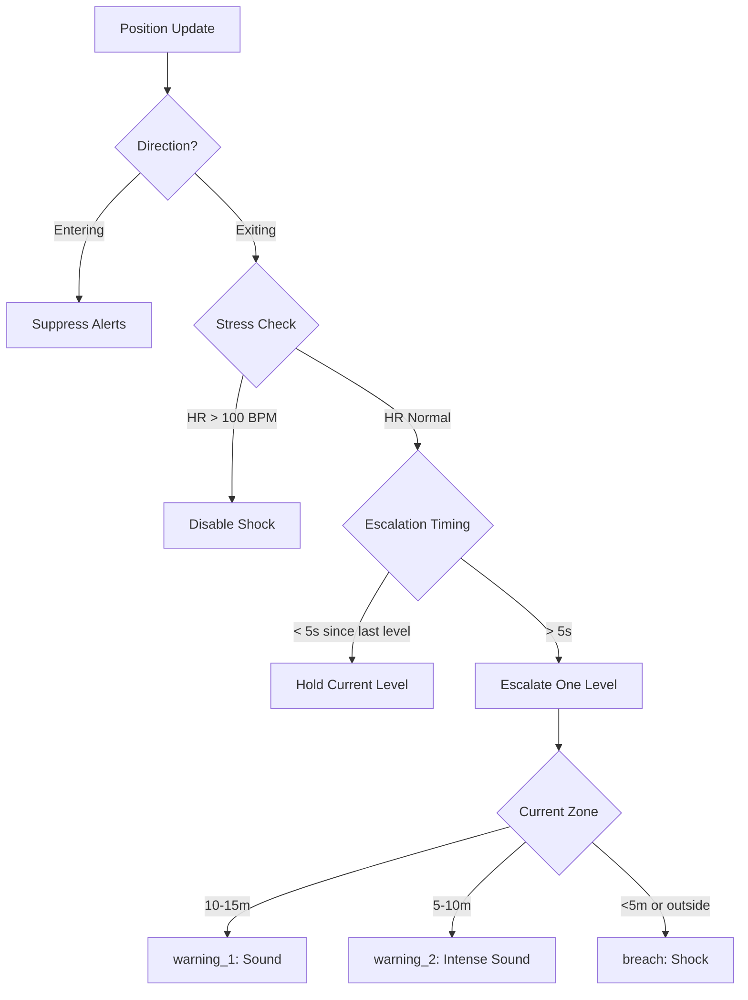

# System Patterns

## Architecture


## Data Ingestion Flow (Hardware & Software)
### 1. Collar → BeagleBone (The "Edge")
- **Technology**: LoRa (Long Range) RF via UART/SPI interface.
- **Hardware**: BeagleBone Black with SX1276/RFM95 LoRa module.
- **Process**:
  1. Collar transmits raw string packet (e.g., `ID=9920;BATT=3.70...;MOV=128`).
  2. LoRa module receives signal and passes bytes to BeagleBone via Serial/UART.
  3. Python/C++ daemon on BeagleBone reads serial port (`/dev/ttyS0`).
  4. Script parses raw string into structured JSON object.

### 2. BeagleBone → Backend (The "Bridge")
- **Technology**: HTTP REST API over Ethernet/WiFi/Cellular.
- **Process**:
  1. BeagleBone constructs JSON payload.
  2. POSTs to `http://<SERVER_IP>:3001/api/collars/data`.
  3. **Bidirectional Sync**: Backend responds with HTTP 201. If a new config exists (e.g., assigned ID), it's included in the response body (`pending_config`).
  4. BeagleBone checks `pending_config` and immediately transmits new settings back to collar via LoRa (RX Window).

## Collar Registration Pattern
1. New collar uses reserved ID (9999)
2. Backend auto-registers on first data POST
3. Farmer assigns via UI → generates unique ID (100+)
4. Next POST response includes `pending_config: { new_id: X }`
5. BeagleBone sends ID to collar during RX window
6. Collar stores in EEPROM, uses for future TX

## IMU & Activity Classification

### What the Collar Sends
The collar sends **MOV (Movement Intensity)**, NOT activity classification:

| Field | Size | Description |
|-------|------|-------------|
| MOV | 1 byte (0-255) | Motion magnitude: `sqrt(ax² + ay² + az²) * scale` |
| Raw IMU (optional) | 12 bytes | 3-axis accel + 3-axis gyro (int16 each) |

**Important**: The collar MCU has limited compute power. It can only calculate a simple motion magnitude, not complex activity patterns.

### Where Classification Happens

| Classification Level | Where | Examples |
|---------------------|-------|----------|
| Basic | BeagleBone | Moving, Resting, Standing, Lying |
| Advanced (ML) | Backend | Rumination, Grazing, Health patterns, Estrus |

### Data Flow for Activity Classification
```
Collar (MCU)           BeagleBone                 Backend
    │                       │                         │
    │  MOV + Raw IMU        │                         │
    ├──────────────────────►│                         │
    │                       │ Buffer samples          │
    │                       │ Compute features        │
    │                       │ Basic classification    │
    │                       │                         │
    │                       │  Aggregated windows     │
    │                       ├────────────────────────►│
    │                       │                         │ ML classification
    │                       │                         │ Health scoring
    │                       │                         │ Alert generation
```

## Health Status Logic
```javascript
// Critical (alert)
body_temp > 40°C OR body_temp < 37°C
battery_voltage < 3.0V
heart_rate > 100 OR heart_rate < 40
spo2 < 90%

// Warning
body_temp 39.5-40°C OR body_temp 37-37.5°C
battery_voltage 3.0-3.3V
heart_rate 84-100 OR heart_rate 40-48
spo2 90-95%
```

## Data Flow Patterns
- **Telemetry**: Collar → BeagleBone → POST /api/collars/data → DB + in-memory Map
- **Movement Intensity (MOV)**: Computed on collar, stored in LocationHistory
- **Activity Classification**: Computed on BeagleBone (basic) or Backend (advanced ML)
- **Config**: Returned in POST response (polling pattern)

## Frontend Patterns
- React Router for navigation
- Polling every 5s for real-time data
- CSS custom properties design system
- Lucide React for icons
- Chart.js for visualizations

## Coding Standards
- Use quoted table names for PostgreSQL ("Collars", "Cattle")
- Environment variables for DB connection
- Reserved collar_id = 9999 for unassigned
- Collar IDs assigned starting from 100

## Virtual Fencing Pattern

### Geofence Alert Flow


### Buffer Zone Configuration (in meters)
| Constant | Value | Description |
|----------|-------|-------------|
| WARNING_1_DISTANCE | 15 | Outer warning zone |
| WARNING_2_DISTANCE | 10 | Inner warning zone |
| BREACH_DISTANCE | 5 | Critical zone |

### Geofence Utilities
- `haversine_distance(lat1, lon1, lat2, lon2)` - Great circle distance in meters
- `point_in_polygon(lat, lon, polygon)` - Ray casting algorithm
- `distance_to_polygon_edge(lat, lon, polygon)` - Minimum distance to boundary

### Fence Sync Pattern
- BeagleBone fetches fences from `GET /api/fences/sync` every 60 seconds
- Fences are cached locally to reduce API calls
- Only active fences (`is_active = TRUE`) are synced

### Buffer Zone Visualization (Frontend)
The LiveMap renders color-coded ring zones using Turf.js:

| Zone | Distance from Edge | Color | Ring Created By |
|------|-------------------|-------|-----------------|
| Breach | 0-5m | Red (#EF4444) | fence - 5m buffer |
| Warning 2 | 5-10m | Orange (#F97316) | 5m buffer - 10m buffer |
| Warning 1 | 10-15m | Yellow (#EAB308) | 10m buffer - 15m buffer |
| Safe | >15m | Green (#10B981) | 15m buffer (center) |

**Implementation**:
- `@turf/turf` library for polygon operations
- `turf.buffer()` with negative distance for inward offset
- **Polygon with holes**: React-leaflet accepts `[outerRing, innerRing]` nested arrays
- Each zone returns `{ outerPositions, innerPositions }` for ring creation
- Toggle button with Eye icon to show/hide zones
- Legend panel in bottom-right corner

### Direction-Aware Alert Protocol
The humane alert system uses direction detection to suppress unnecessary alerts:



| Condition | Action |
|-----------|--------|
| Cattle exiting fence | Apply graduated alerts |
| Cattle entering fence | Suppress alerts (encourage entry) |
| Cattle returning to safe | Suppress alerts (hysteresis) |
| Heart rate > 100 BPM | Disable shock (stress override) |
| Alert escalation | 5s minimum delay between stages |

### Automatic Cattle Spawning
- Simulator spawns new cattle every 60 seconds (12 cycles at 5s interval)
- Unique collar IDs starting from 2001, 2002, 2003, etc.
- Cattle spawn within test bounding box (Reghaïa area)

## Direction-Aware Alert System (Humane Protocol)

### Movement Direction Detection
The `DirectionTracker` class analyzes cattle position history to determine movement direction relative to fence boundaries:

| Direction | Description | Alert Behavior |
|-----------|-------------|----------------|
| `entering` | Moving toward fence interior | Alerts SUPPRESSED |
| `exiting` | Moving toward fence boundary | Alerts APPLIED |
| `stationary` | No significant movement | Alerts applied based on zone |
| `parallel` | Moving along boundary | Alerts applied based on zone |

### Humane Alert Protocol Flow


### Escalation Timing Constants
| Constant | Value | Description |
|----------|-------|-------------|
| `ESCALATION_DELAY_SECONDS` | 5.0 | Min time before escalating alert level |
| `STRESS_HEART_RATE_MAX` | 100 | BPM above which shocks are disabled |
| `GPS_LOW_ACCURACY_BUFFER` | 5 | Extra buffer when GPS accuracy is poor |

### Multi-Fence Logic
- Cattle is SAFE if inside ANY fence
- Cattle is BREACH only if outside ALL fences
- Min distance to any edge determines warning level
- Overlapping fences provide larger safe zones